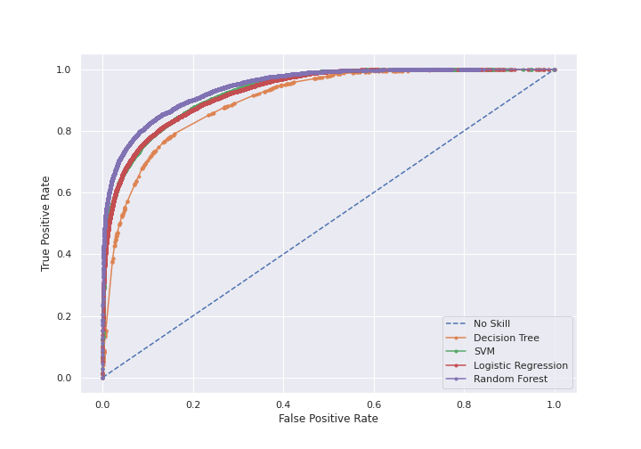
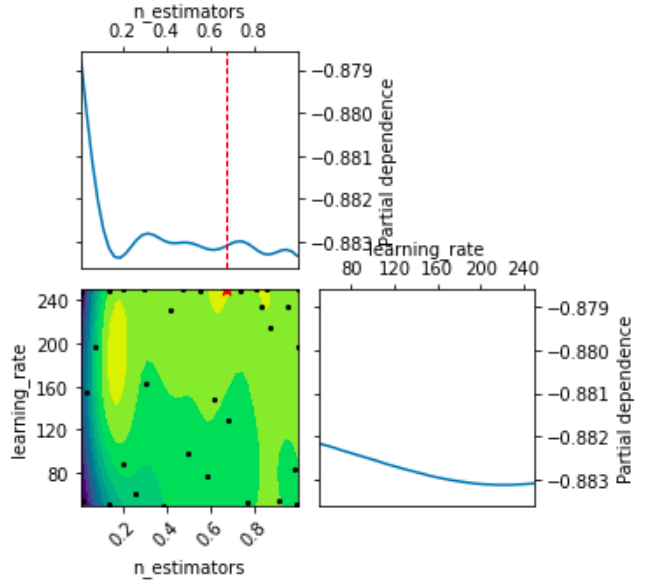

# Predicting Song Popularity Using Machine Learning Algorithms
## Team Aakashvani
### CSE523 - Machine Learning, Ahmedabad University

## Introduction
Being able to predict popularity of a song based on metadata and attributes could be of great industrial importance. We aim to achieve this using machine learning techniques. We use data obtained from Spotify Web API which contains information of over 160,000 songs from 1921 to 2020. We perform the required pre-processing to test several regression and classification algorithms. Based on obtained results, we build ensemble learning models for classification. Models are tuned to give optimal test results. We infer that tree-based algorithms give competitive results in general. Due to imbalanced classification, the models are able to predict non-popular songs more easily than popular ones, where there's a high number of false negatives. 

## Results
### Regression
#### Linear Regression

##### Root Mean Squared Error Plot (vs. Number of features)

#### R2 Score Plot (vs. Number of features)

### Classification

#### ROC Curve

#### Precision Recall Curve

### Ensemble Learning
#### Random Forest generated Feature Importance

#### Adaptive Boosting Bayesian Optimization

## References
- Y. E. Ay, “Spotify dataset 1921-2020, 160k tracks (version 10n)” Jan 2021. [Online]. Available: https://www.kaggle.com/yamaerenay/spotifydataset-19212020-160k-tracks/version/10
- F. Pedregosa, G. Varoquaux, A. Gramfort, V. Michel, B. Thirion, O. Grisel, M. Blondel, P. Prettenhofer, R. Weiss, V. Dubourg, J. Vanderplas, A. Passos, D. Cournapeau, M. Brucher, M. Perrot, and E. Duchesnay, “Scikit-learn: Machine learning in Python,” Journal of Machine Learning Research, vol. 12, pp. 2825–2830, 2011.
- R. Nijkamp, “Prediction of product success: explaining song popularity by audio features from spotify data,” in 11th IBA Bachelor Thesis Conference, 2018.
- A. Singhi and D. Brown, “Can song lyrics predict hits?” 2015.
- R. Dhanaraj and B. Logan, “Automatic prediction of hit songs,” pp. 488–491, 2005.
- Spotify Web API Reference. [Online]. Available: https://developer.spotify.com/documentation/web-api/reference 
- E. Zangerle, M. Pichl, B. Hupfauf, and G. Specht, “Can microblogs predict music charts? an analysis of the relationship between nowplaying tweets and music charts,” in Proceedings of the 17th International Society for Music Information Retrieval Conference 2016 (ISMIR 2016). ISMIR, 2016.
- K. Bischoff, C. S. Firan, M. Georgescu, W. Nejdl, and R. Paiu, “Social knowledge-driven music hit prediction,” in Proceedings of the 5th International Conference on Advanced Data Mining and Applications, ser. ADMA ’09. Berlin, Heidelberg: Springer-Verlag, 2009, p. 43–54.
- A. Géron, Hands-on machine learning with Scikit-Learn, Keras, and Tensorflow: Concepts, tools, and techniques to build intelligent systems. O’Reilly Media, 2019.
- T. Head, M. Kumar, H. Nahrstaedt, G. Louppe, and I. Shcherbatyi, “scikit-optimize/scikit-optimize,” 2020. [Online]. Available: https://zenodo.org/record/4014775 
- J. Snoek, H. Larochelle, and R. P. Adams, “Practical bayesian optimization of machine learning algorithms,” 2012
